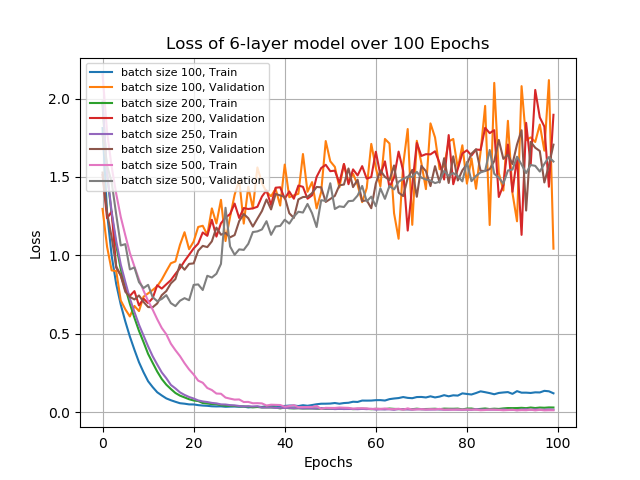

# Image-recognition

This is an image recognition program using python deep learning API Keras

# Run

It is recommended to run the train and test on the GPU.
Run the `train_4layer.py` or `train_6layer.py` for training, and then run the `test10.py` to test categorizing images into 10 classes. Batch size can be customized.

# Results

10 classes test

Accuracy and loss

Confusion matrix

Visualizing cnn layer by layer

1st

2nd

3rd

